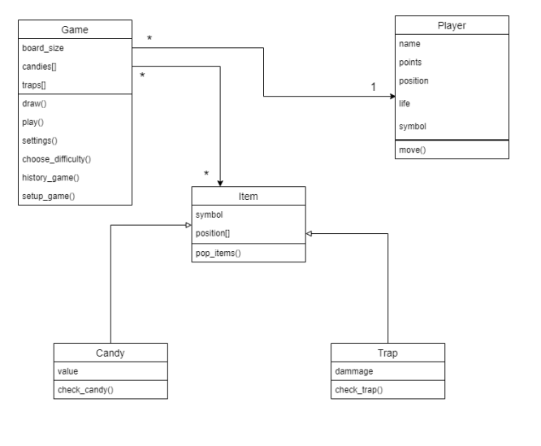

# Contexte
Développement d'un mini-jeu dans le cadre d'un projet scolaire pour améliorer mes compétences en programmation orientée objet (OOP) avec Python. Ce projet permet de créer un système de gestion des déplacements et d'interaction entre des objets tels que le joueur, les bonbons et les pièges, tout en intégrant une gestion du temps et des événements aléatoires.

# Fonctionnement
Dans ce mini-jeu, le joueur se déplace sur un plateau de taille variable pour collecter des bonbons et accumuler des points. Les déplacements sont contrôlés via les touches Z, Q, S, D pour aller respectivement en haut, à gauche, en bas et à droite. Pendant la partie, des bonbons et des pièges apparaissent de manière aléatoire sur le plateau.
Le joueur peut personnaliser son nom, son symbole ainsi que le niveau de difficulté (nombre de points de vie et taille du plateau). Le jeu permet aussi de mettre en pause ou de quitter à tout moment. À la fin de la partie, un historique des scores est sauvegardé dans un fichier texte.

# Diagramme UML du jeu

